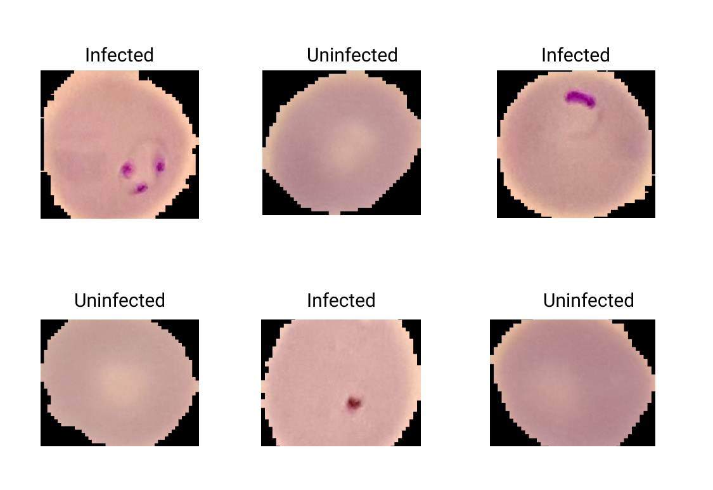

# MalaNet

## Introduction

MalaNet is a convolutional neural network aimed at helping reduce errors due to misinterpretation of image cells of malaria patients.

## Why

I started to explore computer vision with deep learning about three (3) months ago. I was tired of building models with MNIST or FashMNIST dataset as I continued to delve deeper which don't really solve any problem for me. Long story short, I wanted to build an end-to-end deep learning model on my own that can solve a problem.

## Dataset

I obtained the dataset from [kaggle](https://www.kaggle.com/iarunava/cell-images-for-detecting-malaria) which contains 27558 images in total for both infected and uninfected cells.

## Project Information

A pretrained resnet18 was used to perform transfer learning on the dataset.Feature extraction and fine tuning were the performed to improve accuracy.

## Results

The model on the validation dataset achieves 95% accuracy.

## Tools

- Python 3.7.1
- PyTorch
- Matplotlib
- Numpy
